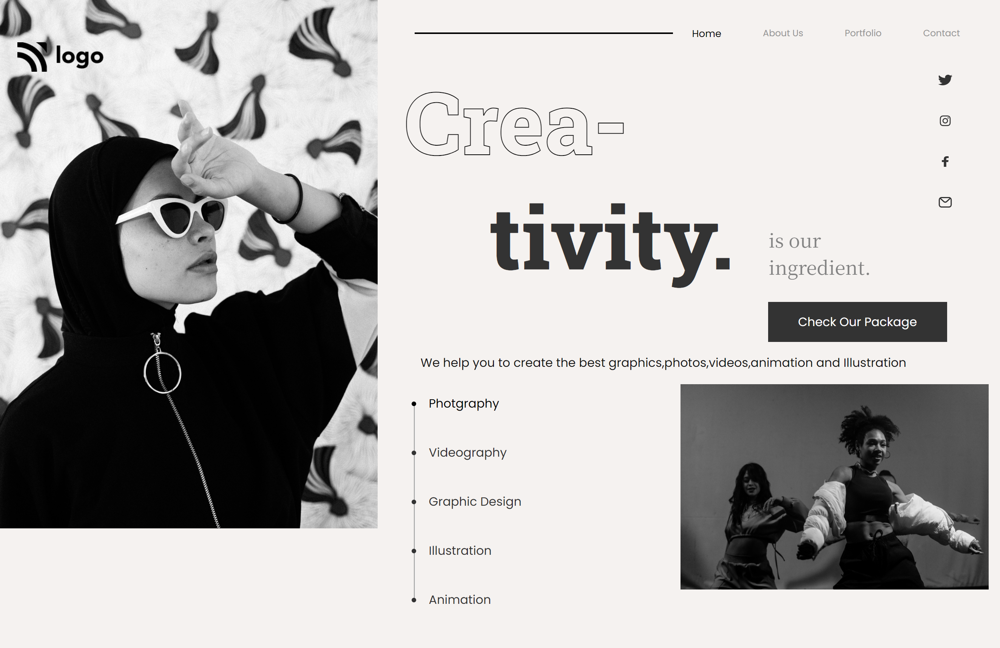
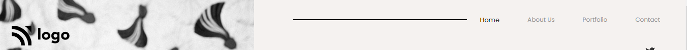
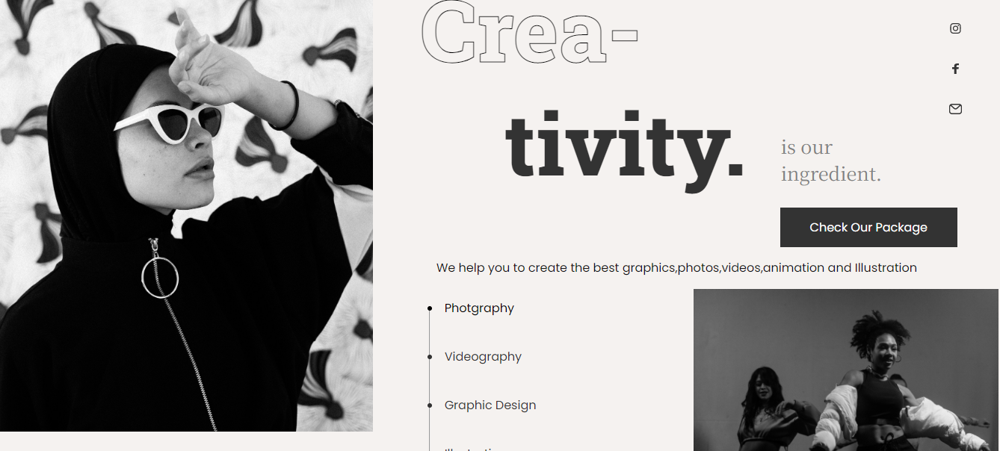

# Project No. 14 (Creativity Page)

This is my _**14th project**_ of Web Development. The project is designed in such a way that it works on large(Desktop & Laptop) as well as small screens(Mobile Devices). In this project, I have learnt **targeting and styling specific elements in CSS**.
> [Check out live project here](https://project-14-by-noman.vercel.app/)

FULL WEBPAGE:

NAVBAR:

BODY:

## Technologies Used

## What I leaned

- How to make a full webpage look beautiful.
- Writing Media Queries.
- How to use hover effectively.
- How to style list with different icons.

# Connect with me

   &ensp;
  &ensp;
  &ensp;
  
